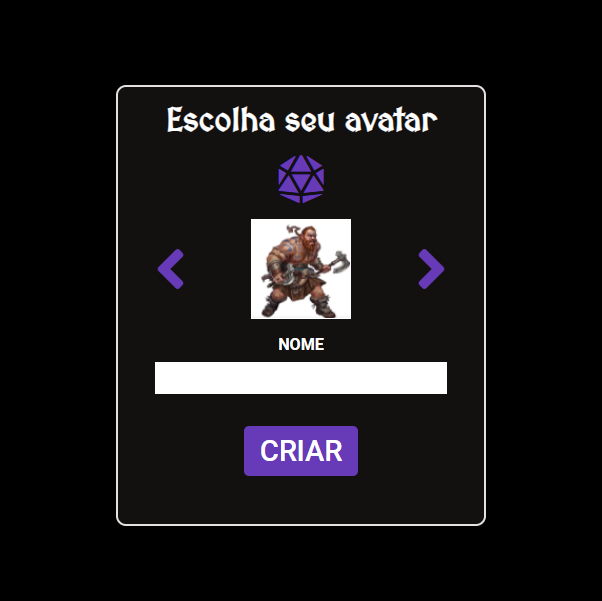
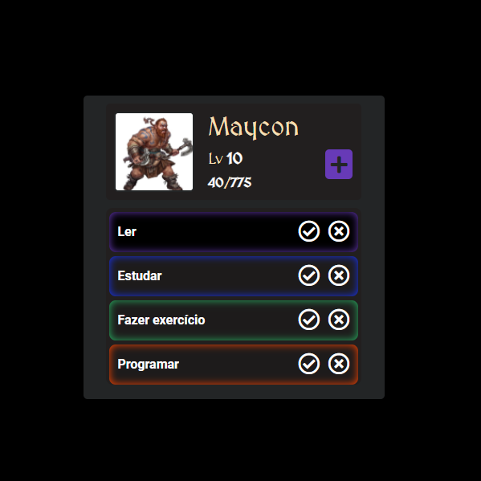
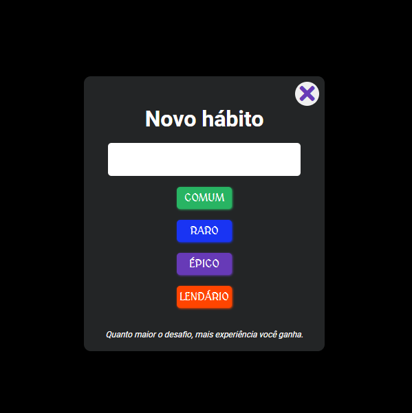

# Gerenciador de habitos gamificado

## Descrição 

O projeto se trata de um gerenciador de habitos com elementos de gamificação, onde o usuário ganha recompensas de acordo com a dificuldade do hábito.

## screenshots

## Feito com:
* HTML  
* CSS
* Javascript

  
